Getting Started
===============

SASEUL is a public blockchain network. Anyone who wants to join the network can establish one’s own SASEUL node. One can
mine resources, host dApps, browse the whole network data and do various interesting things with the SASEUL node.

Specifications
==============

Minimum specs
-------------

* 4 Core CPU

* 16 GB RAM

* 256 GB SSD

Recommended
-----------

* 4 Core+ CPU

* 32 GB+ RAM

* 1 TB+ SSD

Installation
============

You can install SASEUL to various operation systems that supports docker. Installation via source code is not impossible
but it is recommened for normal users to install with the docker image
from [docker hub](https://hub.docker.com/r/artifriends/saseul-network){:target="_blank"}.

1\. Preparation
---------------

### Port fowarding & Static IP

The SASEUL node uses 80 and 443 port of your router. You need to set your router to allow the SASEUL node instance to
use these ports.

**\[Note\]** To see how to set the ports in AWS EC2, go
to [https://docs.aws.amazon.com/AWSEC2/latest/UserGuide/security-group-rules.html](https://docs.aws.amazon.com/AWSEC2/latest/UserGuide/security-group-rules.html)
{:target="_blank"}

**\[Note\]** To see how to allocate a static ip in AWS EC2, go
to [https://docs.aws.amazon.com/AWSEC2/latest/UserGuide/security-group-rules.html](https://docs.aws.amazon.com/AWSEC2/latest/UserGuide/security-group-rules.html)
{:target="_blank"}

2\. Install docker
------------------

### Linux(Amazon Linux 2)

* System Requirements
    * Instance type: r5.xlarge

1. Login to the instance.
    ```bash
    ssh -i {yourKeyFile.pem} {userName}@{host}
    ```

2. Update the system.
    ```bash
    sudo yum update -y
    ```

3. Install docker.
    ```bash
    sudo amazon-linux-extras install docker -y
    ```

4. Change docker permission.

   : When a user is logged in, the user must be authorized and then shut down the SSH connection and re-login to take
   effect.
    ```bash
    sudo usermod -a -G docker ec2-user
    ```

5. Logout from the instance.
    ```bash
    exit
    ```

6. Login to the instance again.
    ```bash
    ssh -i {yourKeyFile.pem} {userName}@{host}
    ```

7. Run docker.
    ```bash
    sudo service docker start
    ```
### Linux(Ubuntu 20.04 LTS)

* System Requirements
    * Instance type: r5.xlarge

1. Login to the instance.
    ```bash
    ssh -i {yourKeyFile.pem} {userName}@{host}
    ```

2. Update the system.
    ```bash
    sudo apt-get update
    ```

3. Installation of required packages.
    ```bash
    sudo apt-get -y install apt-transport-https 
      \ ca-certificates 
      \ curl 
      \ gnupg-agent 
      \ software-properties-common
    ```

4. GPG key authentication.

   : If the word “ok” comes out, it’s a success.
    ```bash
    curl -fsSL https://download.docker.com/linux/ubuntu/gpg | sudo apt-key add -
    ```

5. Register docker repository.

   : In the case of armhf or arm64, the part of arch=amd64 must be replaced with arch=armhf or arch=arm64.
    ```bash
    sudo add-apt-repository \
        "deb [arch=amd64] https://download.docker.com/linux/ubuntu \
        $(lsb_release -cs) \
        stable"
    ```

6. Search for updated and installed docker packages.
    ```bash
    sudo apt-get update && sudo apt-cache search docker-ce
    ```

7. Install docker-ce.
    ```bash
    sudo apt-get update && sudo apt-get install docker-ce docker-ce-cli containerd.io
    ```

8. To facilitate docker-related operations, grant user permissions.

   : When a user is logged in, the user must be authorized and then shut down the SSH connection and re-login to take
   effect.
    ```bash
    sudo usermod -a -G docker ubuntu
    ```

9. Logout from the instance.
    ```bash
    exit
    ```

10. Login to the instance again.
    ```bash
    ssh -i {yourKeyFile.pem} {userName}@{host}
    ```

11. Run docker.

    sudo service docker start

### Windows

* System Requirements

    * **Windows 11 64-bit** : Home or Pro version 21H2 or higher, or Enterprise or Education version 21H2 or higher

    * **Windows 10 64-bit** : Home or Pro 21H1 (build 19043) or higher, or Enterprise or Education 20H2 (build 19042) or
      higher.

    * **WSL 2**

* Install WSL 2 to use docker

    1. Open PowerShell as administrator

    2. Enable the Windows Subsystem for Linux
        ```bash
        $ dism.exe /online /enable-feature /featurename:Microsoft-Windows-Subsystem-Linux /all /norestart
        ```
    3.  Enable the Virtual Machine feature.
        ```bash
        $ dism.exe /online /enable-feature /featurename:VirtualMachinePlatform /all /norestart
        ```
    
    4.  Set WSL 2 as your default version.
        ```bash
        $ wsl --set-default-version 2
        ```
    
    5.  Download the Linux kernel update package and run one of the files below.
        
        1.  If you're using an x64 processor machine ([https://wslstorestorage.blob.core.windows.net/wslblob/wsl\_update\_x64.msi](https://wslstorestorage.blob.core.windows.net/wslblob/wsl_update_x64.msi))
            
            <figure>
                <a href="https://wslstorestorage.blob.core.windows.net/wslblob/wsl_update_x64.msi" class="bookmark source" target="_blank">
                    <div class="bookmark-info">
                        <div class="bookmark-text">
                            <div class="bookmark-title"></div>
                        </div>
                        <div class="bookmark-href">https://wslstorestorage.blob.core.windows.net/wslblob/wsl_update_x64.msi</div>
                    </div>
                </a>
            </figure>
            
        
        2.  If you're using an ARM64 machine ([https://wslstorestorage.blob.core.windows.net/wslblob/wsl\_update\_arm64.msi](https://wslstorestorage.blob.core.windows.net/wslblob/wsl_update_arm64.msi))
            
            <figure>
                <a href="https://wslstorestorage.blob.core.windows.net/wslblob/wsl_update_arm64.msi" class="bookmark source" target="_blank">
                    <div class="bookmark-info">
                        <div class="bookmark-text">
                            <div class="bookmark-title"></div>
                        </div>
                        <div class="bookmark-href">https://wslstorestorage.blob.core.windows.net/wslblob/wsl_update_arm64.msi</div>
                    </div>
                </a>
            </figure>
            
    
    6.  Install your Linux distribution of choice by opening the [Microsoft Store](https://aka.ms/wslstore) and select your favorite Linux distribution.
    
    7.  Set your linux username and password.
        ```bash
        Installing. this may take a few minutes...
        Please create a default UNIX user account. The username does not need to match your Windows username.
        For more information visit: https://aka.ms/wslusers
        Enter new UNIX username: {YourLinuxName}
        New password: 
        Retype new password:
        ```
    
    8.  Check Your Linux Version
        ```bash
        $ wsl -l -v
            
        # if version 1 , change version
        # ex)
        #   NAME               STATE           VERSION
        # * {YourLinuxName}    Running         1
        $ wsl --set-version {YourLinuxName} 2
        ```

* Start Docker

    1. Download docker for windows.

       <figure>
           <a href="https://desktop.docker.com/win/main/amd64/Docker%20Desktop%20Installer.exe" class="bookmark source" target="_blank">
               <div class="bookmark-info">
                   <div class="bookmark-text">
                       <div class="bookmark-title"></div>
                   </div>
                   <div class="bookmark-href">https://desktop.docker.com/win/main/amd64/Docker%20Desktop%20Installer.exe</div>
               </div>
           </a>
       </figure>

    2.  Start Docker Desktop.
        
        1.  Win + s
        
        2.  Search “docker desktop” and Run

### Mac

1. Install Docker Desktop.
   <figure>
   <a href="https://www.docker.com/products/docker-desktop/" class="bookmark source" target="_blank">
       <div class="bookmark-info">
           <div class="bookmark-text">
                   <div class="bookmark-title">Docker Desktop - Docker</div>
                   <div class="bookmark-description">Our Docker Subscription Service Agreement includes a change to the terms for Docker Desktop It remains free for small businesses (fewer than 250 employees AND less than $10 million in annual revenue), personal use, education, and non-commercial open source projects.</div>
           </div>
           <div class="bookmark-href">
               https://www.docker.com/products/docker-desktop/
           </div>
       </div>
       
   </a>
   </figure>


2. Start Docker.

    1. Command + space

    2. Search “docker” and Run

3\. Run the SASEUL node container with docker
---------------------------------------------

1. Open a terminal.

2. make a directory for SASEUL data
    ```bash
    mkdir /var/saseul-data
    ```

3. Pull the saseul-network image.
    ```bash
    docker pull artifriends/saseul-network:latest
    ```
   In case of Mac with apple chip, pull this image instead.
    ```bash
    docker pull artifriends/saseul-network:arm
    ```

4. Run the saseul-node container.
    ```bash
    docker run -d --init --name saseul-node -p 80:80 -v /var/saseul-data:/var/saseul/saseul-network/data artifriends/saseul-network:latest
    ```
Settings
========

* * *

The first thing you would do after initiating the SASEUL node container is to set node environment variables such as
node and peer account or tracker hosts.

Setting the node environment
----------------------------

### Required

* **SetEnv**

  There are three accounts that runs a SASEUL node - node, peer and owner. Node account represents the SASEUL node
  itself which does most of blockchain related jobs. Peer account is an alias address for the node in the network. Owner
  account is the one who gets the mining reward.

  If you have your SASEUL docker container running, you can run SetEnv command to set the three accounts.

    1. Run SetEnv command.
        ```bash
        docker exec -i saseul-node saseul-script SetEnv
        ```
    2.  Follow the dialog.
        ```
            Do you want to set up the env file? [y/n]
        ```
        If y, you will be asked the next question.
        ```
            Do you keep a full ledger? [y/n]
        ```
        If y, ledger type will be set as full ledger. Else, it will be set as partial ledger
        ```
            Do you want to make new random node account? [y/n]
        ```
        If y, a new random node account keypair will be set. Else, a private key will be asked.
        ```
            Do you want to make new random peer account? [y/n]
        ```
        If y, a new random peer account keypair will be set. Else, a private key will be asked.
        ```
            Do you want the mining address to be the same as the address of the node? [y/n]
        ```
        If y, the mining address will be set as the node address. Else, an address will be asked.
        
    
    **\[Note\]** You need to keep the right private key of the owner account to yourself. You would not be able to get the mining reward if you lose it.

### Optional

You can deal with preset values of your SASEUL node using the commands below.

* **SetGenesisAddress**

* **SetMiner**

* **SetNode**

* **SetPeer**

* **AddTracker**

* **AddNetworkAddress**

* **ChangeLedgerType**

**\[Note\]** To get detailed information about these commands,
see [Command Line Interface](https://saseul.com/index.html?handler=Developers&title=Command_Line_Interface){:target="_blank"}.

Getting the node information
----------------------------

Having the SASEUL node environment variables set, you can query those values as well.

### Required

* **GetEnv**

  The SASEUL node stores node address variables such as node address, peer address and node owner address and network
  address variables such as manager address and genesis address and ledger type and master process port number in the
  env file. You can get the content of the env file using the GetEnv command.
    ```bash
    docker exec -i saseul-node saseul-script GetEnv
    ```
    * Return value
        ```
          Node address: 9d49ca0cc7e3bb8717676524bf669135a9fc21e56ca8
          Peer address: 88a6031b3fb5d8ef18ece5394f71d162d425d9051d3f
          Node owner: 9d49ca0cc7e3bb8717676524bf669135a9fc21e56ca8
          
          Manager Addresses:
          0: c63e540b26715f490d763338f1b3f1f60990935f0837
          
          Genesis Address: c63e540b26715f490d763338f1b3f1f60990935f0837
          Ledger type: full
          Master process port: 9933
        ```

* **GetAccount**

  The most important information of the SASEUL node is the private keys of the accounts. You can get the keypairs of the
  node and peer accounts and the address variable of the node owner account using the GetAccount command.
    ```bash
      docker exec -i saseul-node saseul-script GetAccount
    ```
    * Return value
        ```
          Node private key: 0728d819f7475832dcf56b44b2a56d975d29d972fe8f15828105e18683715a95
          Node public key: b483c973f9446ac6e8393f26fab1fdb42bf7f301bda7880d7fe8503488efc91d
          Node address: 9d49ca0cc7e3bb8717676524bf669135a9fc21e56ca8
          
          Peer private key: 9b356a8728b1eafec1d7e40c2d8005928203e54c5e3dd4e47905e18683837695
          Peer public key: 6dffedfa4c46ac120f5e91e8e896a0612df40a2e928e0cebc4f8831793002422
          Peer address: 88a6031b3fb5d8ef18ece5394f71d162d425d9051d3f
          
          Node owner: 9d49ca0cc7e3bb8717676524bf669135a9fc21e56ca8
        ```
    **\[Note\]** GetAccount command doesn’t give the private key of the node owner address. The SASEUL node does not store the private key of the node owner, you should keep it to yourself.

### Optional

* **Peer**

**\[Note\]** To get detailed information about these commands,
see [Command Line Interface](https://saseul.com/index.html?handler=Developers&title=Command_Line_Interface){:target="_blank"}.

Operation
=========

Starting the SASEUL node
------------------------

Having set the environment variables, now you are ready to start the SASEUL node. The SASEUL node is run by service
processes such as chain maker, collector, peer searcher, resource miner and master. You can run the Start command to run
the master process which autonomously orchastrates the other processes by itself.

* **Start**
    ```bash
    docker exec -i saseul-node saseul-script Start
    ```
You can check the current process status and other information of the SASEUL node by running the Info command.

* **Info**
    ```bash
    docker exec -i saseul-node saseul-script Info
    ```
    * Return value
        ```
          [Info]
          chain_maker_policy: 1 # 1 if true, 0 if false
          resource_miner_policy: 1 # 1 if true, 0 if false
          peer_searcher_policy: 1 # 1 if true, 0 if false
          collector_policy: 1 # 1 if true, 0 if false
          mining: 1 # 1 if true, 0 if false
          last_block:
            height: 30443
            s_timestamp: 1655359731000000
            previous_blockhash: 05e18a752a5bc036c406652cf3720095a345936de4246cc3ebaf64587b6de7eacb39e882cb1512
            blockhash: 05e18a78bde2c08de7cbbfec2c20df450b6ed3349ded1dc6f1168c125844fca485c4d84e44c816
            transaction_count: 1
          last_resource_block:
            height: 49466
            blockhash: 05e18a960d245af5c17714fbb698fa6c76204cf4704195e6d5d484587cb1cdd75304d2cfd76465
            previous_blockhash: 05e18a93832c6adcd70c574b9fa5fecd23e9cc4e14febce9002df2391d668e26b312d46374162e
            nonce: 0a7ad1f1922f60469a08b7ac95013783a15a7c9cbe3e19eea30a2816fe47f7f7
            timestamp: 1655360222733402
            difficulty: 6067098
            main_height: 30443
            main_blockhash: 05e18a78bde2c08de7cbbfec2c20df450b6ed3349ded1dc6f1168c125844fca485c4d84e44c816
            validator: bf48b24174df88424145fbb2018cec5a2271115043d3
            miner: bf48b24174df88424145fbb2018cec5a2271115043d3
            receipt_count: 1
          
          [Miners]
          0: 63bb77fa59bbf7dba1de14b3bb7225cbde98793a2c42
          1: bf48b24174df88424145fbb2018cec5a2271115043d3
          2: 21963089ed8ce35a0edc8227b06ed8c1395119ca662a
          3: 74dc281622eda969a493c785231515bed69077fc7bc1
          4: 67ed319a52601f14b1fb691b85fac19f7f468b2538f8
          5: 08f080b723d4f4465ba54d10ab179f2bfb89e289a02e
          6: bf48b24174df88424145fbb2018cec5a2271115043d3
          7: 28c8f4d7e83cbe5ae7288e2a2a0421ccd461f3d1c2bf
          8: c99c5f6fe9b014fbbe80b0da10ca563b798c61ace3c9
          
          [Validators]
          0: c99c5f6fe9b014fbbe80b0da10ca563b798c61ace3c9
          1: 28c8f4d7e83cbe5ae7288e2a2a0421ccd461f3d1c2bf
          2: bf48b24174df88424145fbb2018cec5a2271115043d3
          3: e6741964b2191c7c993b39e6029f06872bd7348851b4
          4: 67ed319a52601f14b1fb691b85fac19f7f468b2538f8
          5: 74dc281622eda969a493c785231515bed69077fc7bc1
          6: 21963089ed8ce35a0edc8227b06ed8c1395119ca662a
          7: bf48b24174df88424145fbb2018cec5a2271115043d3
          8: 63bb77fa59bbf7dba1de14b3bb7225cbde98793a2c42
        ```
You can stop, restart and kill the SASEUL node’s processes using these commands.

* **Stop**

* **Restart**

* **Kill**

**\[Note\]** To get detailed information about these commands, see [**Command Line
Interface**](https://saseul.com/index.html?handler=Developers&title=Command_Line_Interface)**.**

Syncing to the network
----------------------

The SASEUL node simultaneously keeps syncing its block data and status to the network. A new SASEUL node needs to
maintain the latest block height of the network to be recognized as a synced peer within the network. You can go
to [SASEUL Explorer](http://explorer.saseul.com/network.html)(explorer.saseul.com) to check if your SASEUL node is
currently synced to the network.

Mining Resources
----------------

The mining process trys to make a new resource block and commit to the network.

The miner node of the resource block becomes one of the validator nodes of the main chain which participates in the main
chain block generation. A validator node has a right to make main blocks by processing transaction recipts. Some amount
of Resource would be paid by the network when a validator successfully process a transaction receipt. Resource can be
converted to SL by executing the Refine contract.

You can start the mining process by running the StartMining command.

* **StartMining**
    ```bash
    docker exec -i saseul-node saseul-script StartMining
    ```
And check the SASEUL node’s mining process status by running the Info command.

* **Info**
    ```
    [Info]
    chain_maker_policy: 1 # 1 if true, 0 if false
    resource_miner_policy: 1 # 1 if true, 0 if false
    peer_searcher_policy: 1 # 1 if true, 0 if false
    collector_policy: 1 # 1 if true, 0 if false
    mining: 1 # 1 if true, 0 if false
      
    #(...)
    ```
You can stop the mining process by running the StopMining command.

* **StopMining**
    ```bash
    docker exec -i saeul-node saseul-script StopMining
    ```
Refining SL
-----------

Once you have enough Resource mined in your node owner address, you can execute refine contract to make SL coin. You can
use [Guardee wallet](https://guardee.app)(guardee.app) to manage your Resource and SL coin.

Guardee wallet supports IOS and Android. You can download it from google play store and apple app store by searching
‘Guardee’. Once you installed the app follow the steps below.

1. Press start(시작하기) to make a new wallet or press restore(복구하기) button to restore from an existing wallet seed phrase
   or keyfile. In this tutorial, press start(시작하기) button.

[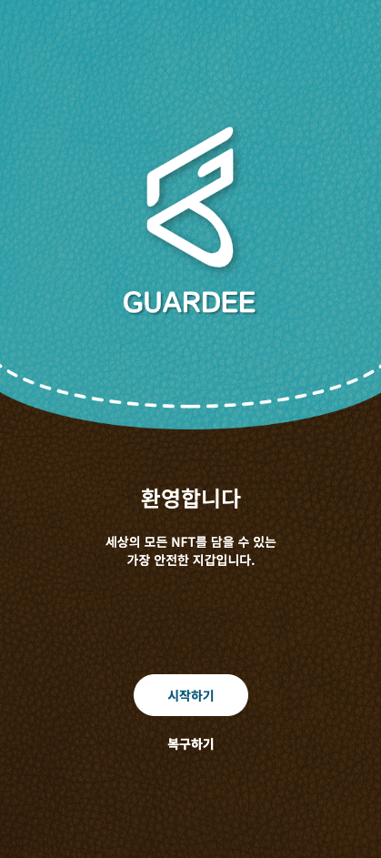](../../assets/img/saseul-node/3.23.15.png)

2. Enter a password and press next(다음) button.

[](../../assets/img/saseul-node/3.24.38.png)

3. Copy the seed phrase and paste it somewhere safe and press next(다음) button.

[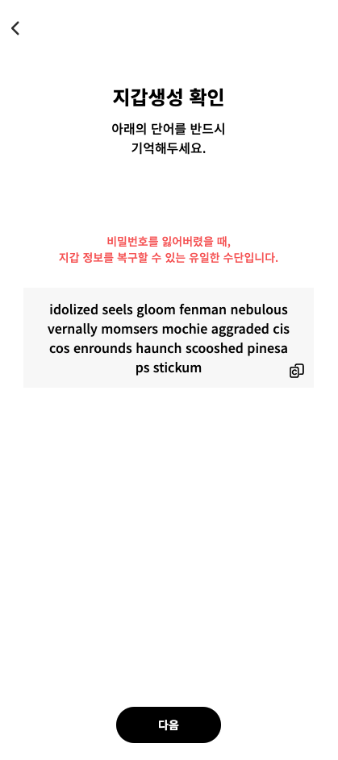](../../assets/img/saseul-node/3.31.21.png)

4. Guardee wallet is created. Press the menu button.

[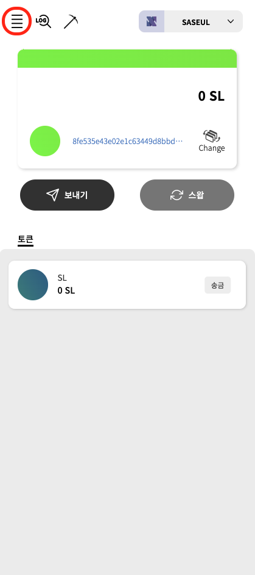](../../assets/img/saseul-node/3.33.55.png)

5. Select my accounts(보유 계좌).

[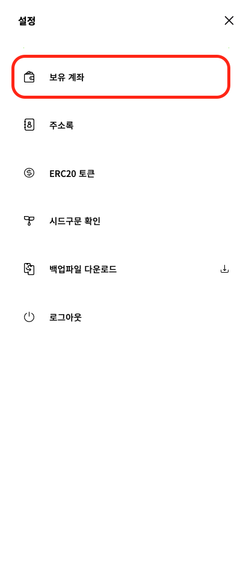](../../assets/img/saseul-node/3.35.53.png)

6. Select import SASEUL account with private key(개인키로 SASUL 계좌 가져오기) button.

[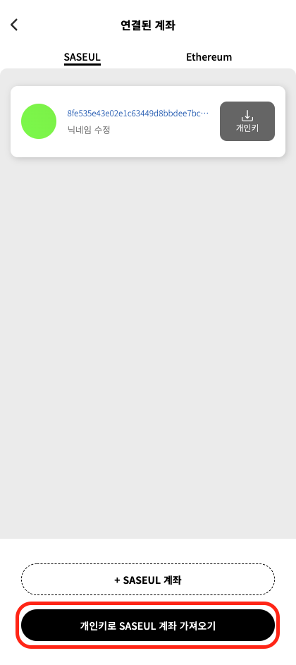](../../assets/img/saseul-node/3.36.50.png)

7. Type your node owner private key and press confirm(확인) button.

[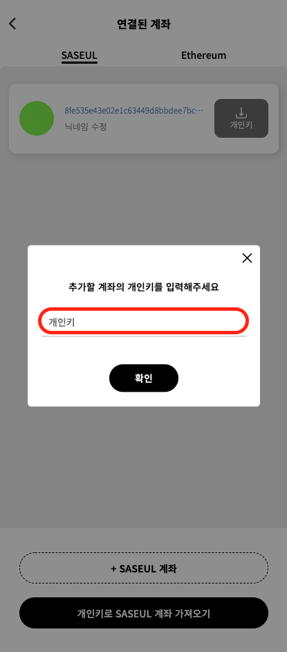](../../assets/img/saseul-node/3.38.17.png)

8. Your node owner account is imported. Press the back button to go to the main wallet page.

[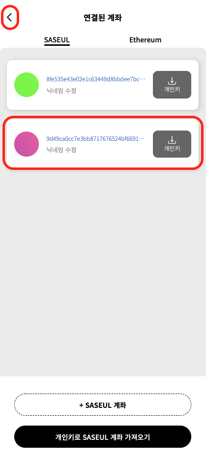](../../assets/img/saseul-node/3.41.55.png)

9. Press the change button.

[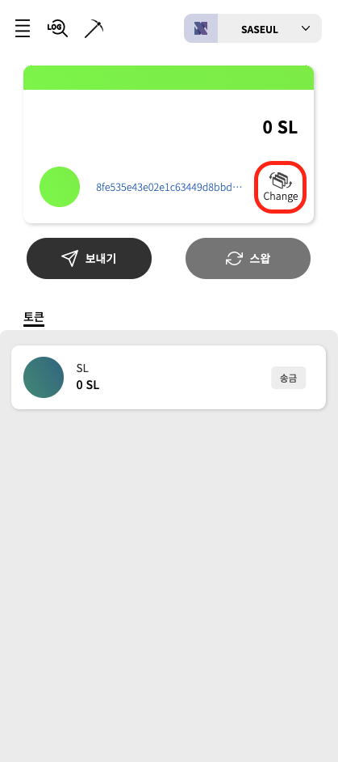](../../assets/img/saseul-node/3.54.43.png)

10. Swipe to change to the node owner account and press it.

[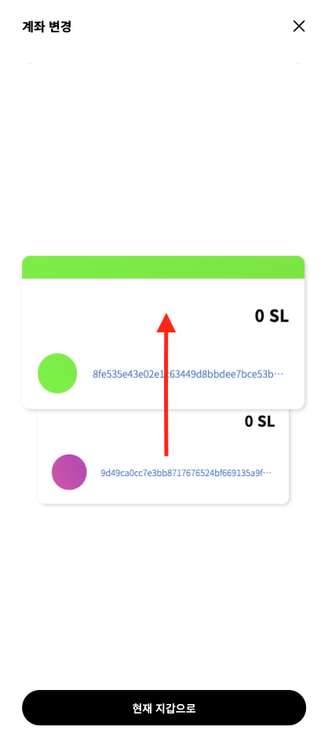](../../assets/img/saseul-node/3.44.10.png)

11. Press the miner button.

[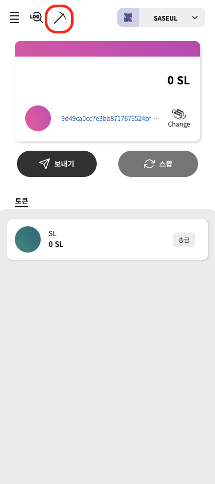](../../assets/img/saseul-node/4.00.15.png)

12. If you have enough amount of Resource, press refine(정제) button.

[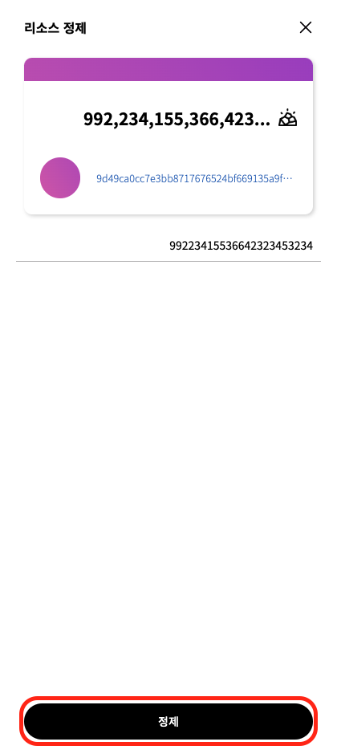](../../assets/img/saseul-node/3.48.01.png)

13. Now you have SL in your node owner account.

[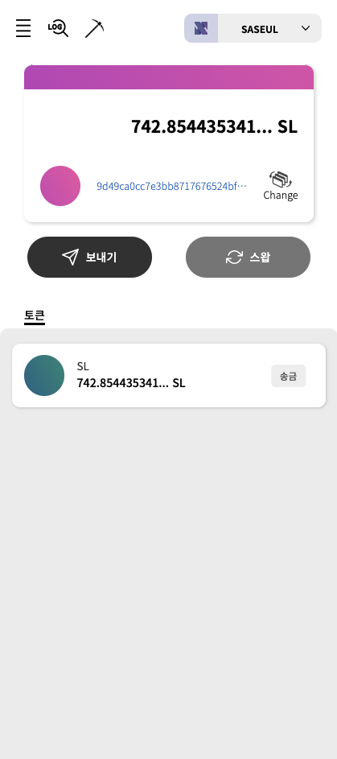](../../assets/img/saseul-node/3.54.06.png)

Restoring the SASEUL node
-------------------------

SASEUL is a new and vigorously expanding blockchian engine. You might be required to get the latest SASEUL image and
restart your SASEUL node.

### 1\. Back up your node owner account

The first thing you need to do to restore an existing node is to back up the node’s account variables. The most
important variable is the node owner(mining address). If you have set the node owner same as the node address, you can
get your node owner keypair by running the GetAccount command. If you have set the node owner with your own private key,
that is what you need to restore the SASEUL node.

### 2\. Stop and remove the SASEUL docker container

Stop and remove the running SASEUL docker container by running the following commands.
```bash
docker stop saseul-node

docker rm saseul-node
```
### 3\. Get the latest SASEUL image and run a new container

Pull the latest SASEUL image and run a new SASEUL container by running the following commands.
```bash
docker pull artifriends/saseul-network:latest

docker run -d --init --name saseul-node -p 80:80 -v /var/saseul-data:/var/saseul/saseul-network/data artifriends/saseul-network:latest
```
### 4\. Set environment variables

Set environment variables by running the SetEnv command.
```bash
docker exec -i saseul-node saseul-script SetEnv
```
Follow the dialog.
```
Do you want to set up the env file? [y/n]
y
    
Do you keep a full ledger? [y/n]
y
    
Do you want to make new random node account? [y/n]
y
    
Do you want to make new random peer account? [y/n]
y
    
Do you want the mining address to be the same as the address of the node? [y/n]
n
    
Please enter address.
[Enter the mining address] <----- (The address you want to get mining result. Usually your used wallet address.)
```
### 5\. Start the SASEUL node

Start the SASEUL node by running the Start command.
```bash
docker exec -i saseul-node saseul-script Start
```